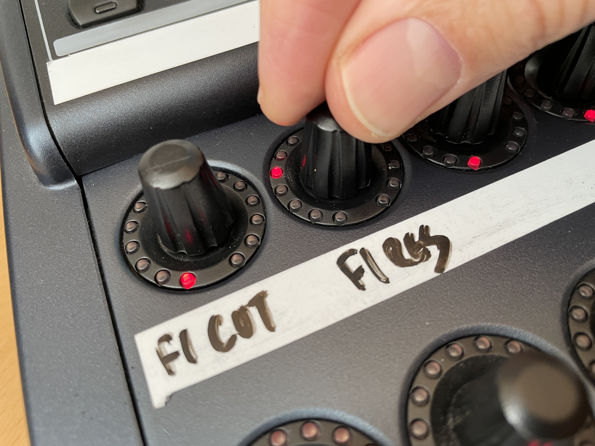
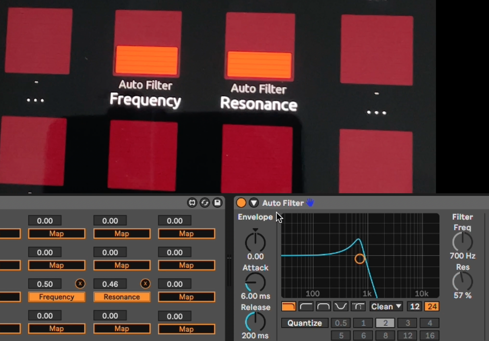
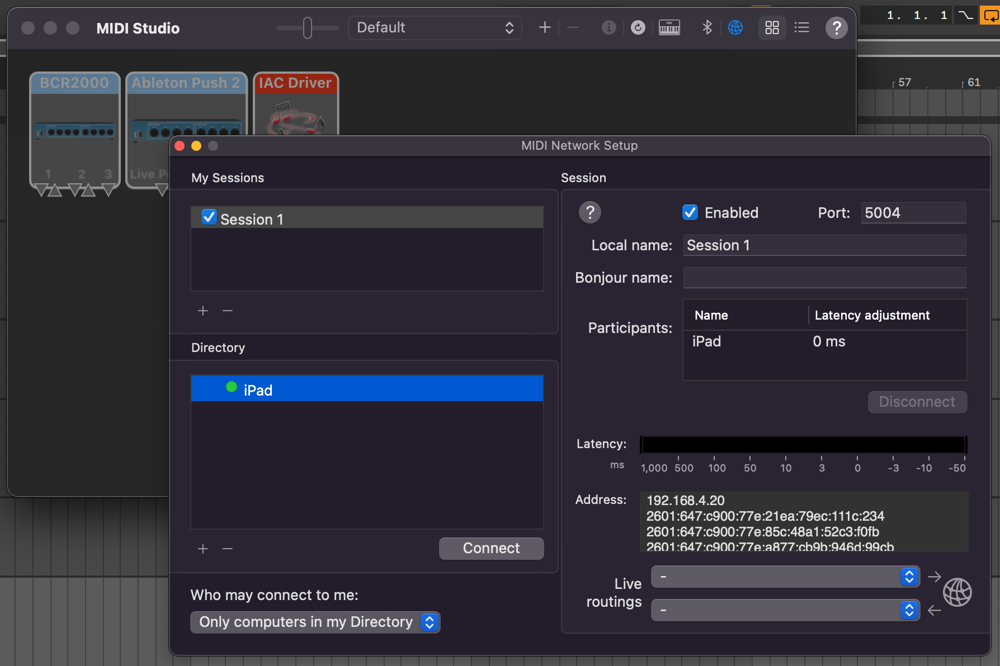
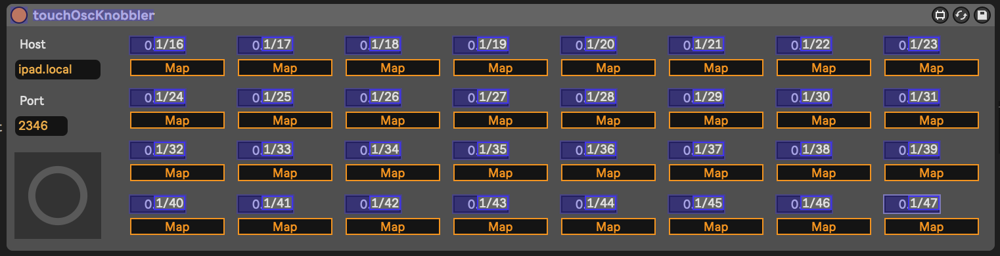

# m4l-zs-Knobbler

This is a Max For Live device and a TouchOSC template that provides a flexible control surface that auto-labels parameter controls when a parameter is mapped.

The problem with in-the-box musicmaking is that the best control surfaces like the Push 2 are modal, requiring you to navigate menus to find parameters, and non-modal surfaces like the BCR-2000 require you to either remember knob assignments or write them on the device itself. This poses a barrier to switching between projects, or simply remembering knob assignments from day-to-day.

With the zs-Knobbler, you get 32 auto-labeling fader controls, 10 other faders, and 8 buttons.

Old analog world:

New digital world:

## Requirements

* Computer running Ableton Live Suite (instructions below assume a Mac)
* iPad running TouchOSC
* Computer and iPad on the same network

## Using

* Clone this repository or download the .amxd and .tosc files.

* Add the zs-Knobbler.amxd file to your Ableton Live project. I like to put it on a track named "META" at the top of the set. This track holds other devices and information for this song.

* Open the .tosc file in TouchOSC on your iPad.

* You will need to configure the Network Session MIDI connection on your Mac in the Audio MIDI Setup application (in Applications/Utilities), and connect to your iPad.

* Then go to the MIDI preferences in Ableton Live and make sure Network Session 1 has the "Remote" checkbox checked.

* Set the `Host` value in the M4L device to be the hostname or IP address of your iPad. You can get that info from the iPad's wifi settings.

* You will then need to map the 32 red sliders in the TouchOSC interface to the 32 numeric parameters in the M4L device. Press Cmd-M, click the first number, and then touch the first slider. Repeat 31 more times, then press Cmd-M to exit MIDI-mapping mode.

* At this point, you can now click "Map" next to a parameter in the Knobbler device, then click any parameter on any track in your Live set. The display on the iPad should update to reflect the parameter name and its device name, as well as indicate its current value.

* Click the small "X" button next to the parameter name to un-map the parameter.

* If you update a device name, you can click the button under "Refresh Names" to update all displayed names on the iPad.

## Customizing

You can make your own TouchOSC template and use it with the M4L device to get auto-labeling. You just need to name your TouchOSC template labels `paramN` and `deviceN` where N is a number between 1 and 32.

## TODO

* ... more here soon ...

## Changelog

* 2022-02-26 Initial release

## Contributing

I'd love it if others extended or improved this device. If you would like to contribute, simply fork this repo, make your changes, and open a pull request and I'll have a look.
